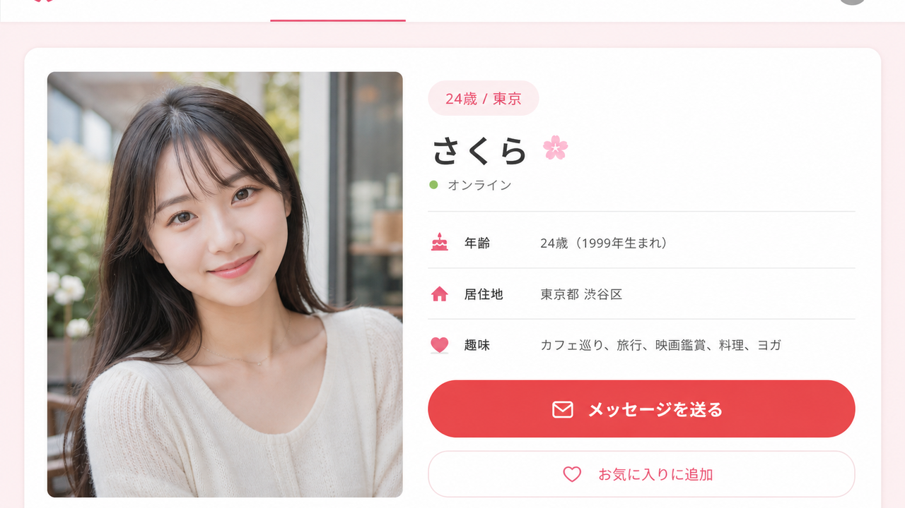
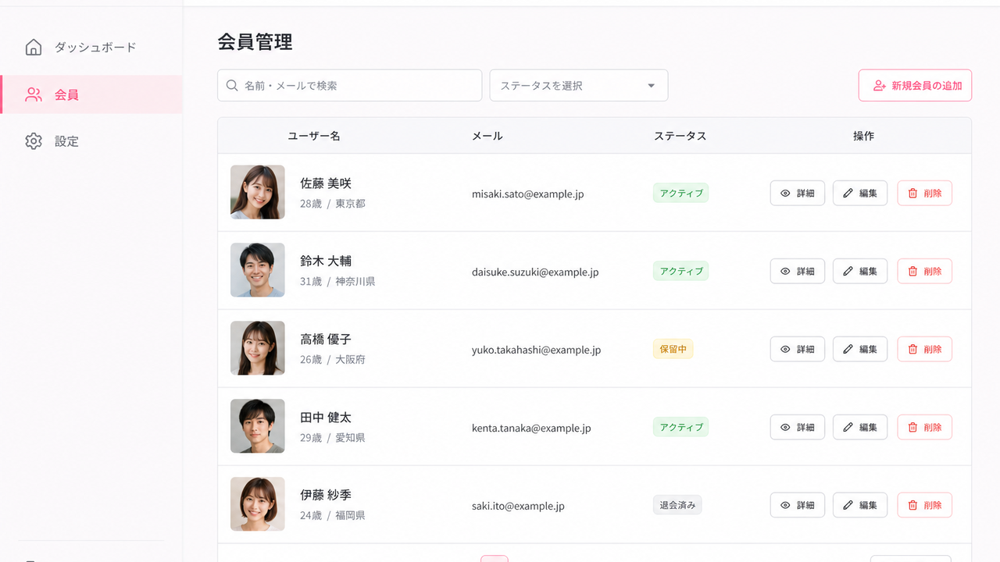

# pH7Builder

ホワイトラベルの出会いサイト、マッチングコミュニティ、ソーシャルネットワークを
自前で構築するための、オープンソースの PHP ソフトウェアです。コード、ホスティング、
データベース、会員データは自分で管理できます。

旧称 pH7CMS。初期言語は **日本語** です。

[](https://github.com/pH7Software/pH7-Social-Dating-CMS/actions/workflows/test.yml)
[](https://github.com/pH7Software/pH7-Social-Dating-CMS/actions/workflows/phpstan.yml)
[](https://github.com/pH7Software/pH7-Social-Dating-CMS/actions/workflows/composer.yml)
[](composer.json)
[](LICENSE.md)

**必要なもの:** PHP 8.2 以上、MySQL 8.0 以上、URL 書き換え、ウェブサーバー。
ソースから入れる場合のみ Composer 2 が必要です。リリース ZIP には本番用依存関係が
含まれます。サーバーが用意できていれば、導入と案内付きインストーラーに
**20〜30 分** 程度見てください。DNS、TLS 証明書、メール事業者の承認は別途です。

[クイックスタート](docs/QUICK_START.md) ·
[アップグレード案内](docs/UPGRADING.md) ·
[公開チェックリスト](docs/LAUNCH_CHECKLIST.md) ·
[リリース案内](docs/)

<p align="center">
  
</p>

## 自分で運営するために

pH7Builder は、借り物の SaaS ではなく、自分でホストする選択肢です。
選んだインフラにデプロイし、ソースを自分のニッチに合わせ、アプリケーション、
データベース、ファイル、会員データを自分で管理できます。公開必須の
「Powered by」リンクはありません。MIT ライセンスの表示は、コピーまたは
実質的な部分に残してください。

セルフホストなら、メディア、キャッシュ、サーバー資源の使い方も自分で決められます。
実際の負荷はホスト、トラフィック、コンテンツ、設定によって変わります。

<p align="center">
  
</p>

## 含まれる機能

- 会員プロフィール、検索、マッチング、近くの人、友達、アクティビティ。
- プライベートメッセージ、インスタントチャット、通知、コメント、フォーラム、ブログ、写真、動画。
- 会員グループ、有料プラン、広告、アフィリエイト、対応決済ゲートウェイ。
- アカウント承認、報告、モデレーション、登録制限、ブロック、任意の画像審査。
- 多言語ルートとコンテンツ、日本語インターフェース、複数テーマ、管理画面、HTTPS 時の PWA。
- pH7Framework と PH7Tpl を使ったモジュール型 MVC アプリケーション。

使える機能は有効にしたモジュールと外部サービスに依存します。本番で会員や決済を
受け付ける前に、[公開チェックリスト](docs/LAUNCH_CHECKLIST.md) を完了し、
実際の本番設定でテストしてください。

<details>
  <summary><strong>機能の詳細</strong></summary>

- **発見とマッチング:** 高度な会員検索、行動マッチング、関連プロフィール、近くの人、Hot or Not、評価、共通の友達、訪問、いいね、プロフィール背景、プライバシー設定。
- **発信と会話:** プライベートメール、インスタントメッセージ、チャット、通知、コメント、ブログ、ノート、フォーラム、ページ、写真アルバム、動画、ニュースレター、招待、アクティビティ。
- **ビジネス:** 会員グループと権限、有料プラン、広告、アフィリエイト、決済連携、基本分析、データベースバックアップ、ファイル管理、動的プロフィール項目、CSV ユーザー取り込み。
- **信頼とモデレーション:** 会員・コンテンツ承認、違反報告、ブロック、国制限、ログイン試行保護、登録制限、重複コンテンツ検査、任意の画像審査、二要素認証、設定した事業者による SMS 認証。
- **基盤:** 多言語ルートとインターフェース、レスポンシブテーマ、SEO、サイトマップと RSS、REST API、PWA、クロン、メンテナンスモード、評価用サンプルプロフィール生成。

</details>

## 必要環境

- PHP 8.2 以上。`curl`、`dom`、`exif`、`fileinfo`、FreeType と WebP 付き GD、`hash`、`iconv`、`json`、`mbstring`、`openssl`、`pdo_mysql`、`simplexml`、`xmlwriter`、`xml`、`zip`、`zlib`。
- MySQL 8.0 以上（`utf8mb4`）。古い MySQL と MariaDB はこのリリースでは検証していません。
- URL 書き換え付き Apache、または同等のルーティングと保護パスを持つ nginx。
- ソースからの導入では Composer 2 と外部インターネット。
- サーバーの sendmail、または環境変数 `PH7_MAILER_DSN` による SMTP。管理画面フォームには SMTP 認証情報を保存しません。
- 本番では HTTPS。
- ローカル動画変換を使う場合のみ FFmpeg。

ブラウザーインストーラーは、実行環境、拡張、書き込みパス、MySQL バージョン、
データベース接続を、スキーマ取り込み前に確認します。

## クイックスタート

### Docker でのローカル評価

開発・評価用です。本番デプロイには使いません。

```console
git clone https://github.com/pH7Software/pH7-Social-Dating-CMS.git
cd pH7-Social-Dating-CMS
docker compose up --build -d
docker compose exec php php _install/create-install-token.php
```

表示された一度限りのトークンをコピーし、<http://localhost:8080> を開いて入力します。
インストーラーでは、ホスト `db`、データベース `ph7builder`、ユーザー `ph7builder`、
パスワード `ph7builder`、ポート `3306` を使います。チェックアウトは Docker ボリュームに
スナップショットされます。変更したソースを試すには、`docker compose down -v` のあと
`docker compose up --build -d` を実行します。ローカルのアプリとデータベースボリュームは
削除されます。

インストーラーの初期言語は日本語です。

### 本番

タグ付き [リリース](https://github.com/pH7Software/pH7-Social-Dating-CMS/releases)
の ZIP を使い、必要な書き込みパスだけを設定し、ウェブサーバーを整えてから
`/_install/` を開きます。ブラウザーインストーラーを開く前に、デプロイ先で
インストーラーアクセストークンを生成してください。

```console
curl -LO https://github.com/pH7Software/pH7-Social-Dating-CMS/releases/download/v18.6.1/pH7Builder-v18.6.1.zip
curl -LO https://github.com/pH7Software/pH7-Social-Dating-CMS/releases/download/v18.6.1/pH7Builder-v18.6.1.zip.sha256
sha256sum -c pH7Builder-v18.6.1.zip.sha256
unzip pH7Builder-v18.6.1.zip
cd pH7Builder-v18.6.1
```

Composer からも同じタグ付きリリースを入れられます。

```console
composer create-project ph7software/ph7builder:18.6.1 pH7Builder-v18.6.1 --no-dev --prefer-dist
```

詳細な手順（データベース作成、権限、nginx/Apache、HTTPS、クロン、メール、決済、
最初のテスト登録）は [本番クイックスタート](docs/QUICK_START.md) にあります。

> [!IMPORTANT]
> `_protected`、`_repository`、`_tests`、`_tools`、`.git`、インストーラー非公開
> ディレクトリを公開しないでください。同梱の [`nginx.conf`](nginx.conf) が本番で
> 必要な保護の例です。ドメイン、ドキュメントルート、ログパス、PHP-FPM ソケットは
> 自分のサーバーに合わせて置き換えてください。

## インストールから公開まで

インストール後、`/admin123/` にログインし、次の順で進めてください。

1. **ブランディング:** 設定 → 一般、メタタグ / ホームページ文言、テーマ。
2. **登録:** 設定 → 登録。有効化とモデレーション規則を意図して選ぶ。
3. **会員プラン:** 課金 → 会員プラン一覧。制限と価格を確認する。
4. **決済:** 課金 → ゲートウェイ設定。まずテスト認証情報から始め、使わないものは無効にする。
5. **メール:** 設定 → メールで送信者情報を設定。SMTP は `PH7_MAILER_DSN` かサーバーの sendmail で設定し、配信と迷惑メール判定を確認する。
6. **自動化:** 設定 → 自動化にクロン URL 用の秘密があります。[クイックスタート](docs/QUICK_START.md#7-configure-cron) のジョブを参照。
7. **公開:** [公開チェックリスト](docs/LAUNCH_CHECKLIST.md) のセキュリティ、法務、モデレーション、バックアップ、メール、決済を完了する。

## アップグレード

毎回、データベースとアプリケーションファイルをバックアップしてください。
バージョン固有の移行はリリースノートを読み、ローカル設定を残し、
[手動アップグレード案内](docs/UPGRADING.md) を実行し、キャッシュを消し、
本番の前にステージングで確認してください。未確認のブランチアーカイブで
稼働中のインストールを上書きしないでください。

## 翻訳

インターフェースの初期言語は日本語（`ja_JP`）です。言語パックは
`_protected/app/langs/` にあります。インストーラーも日本語が初期選択です。

## 画面ギャラリー

同梱テーマはレスポンシブで、出会いブランドやコミュニティに合わせて変えられます。
表示される画面とモジュールは、選んだテーマと有効な設定によります。

<p align="center">
  
</p>

<p align="center">
  
  
</p>

<p align="center">
  
</p>

## ドキュメントとサポート

- [リリース案内](docs/)
- [セキュリティ方針](SECURITY.md)

バグ報告の前に既存の issue を検索してください。脆弱性は `SECURITY.md` の手順で
非公開に報告してください。

## コントリビュート

バグ修正、テスト、ドキュメント、モジュール、テーマ、翻訳を歓迎します。
[CONTRIBUTING.md](CONTRIBUTING.md) を読み、プルリクエストは焦点を絞り、
そこに書かれたテストと静的解析コマンドを実行してください。

## 作者

Nana（kirakira-nana）

<p align="center">
  
</p>

pH7Builder が役立つなら、オープンソースの継続的な保守を支援できます。
[](https://ko-fi.com/phenry)
[](https://www.buymeacoffee.com/ph7cms)

## ライセンス

pH7Builder は [MIT License](LICENSE.md) で配布されます。プロジェクトおよび
第三者の表示については [COPYRIGHT.md](COPYRIGHT.md) を参照してください。
